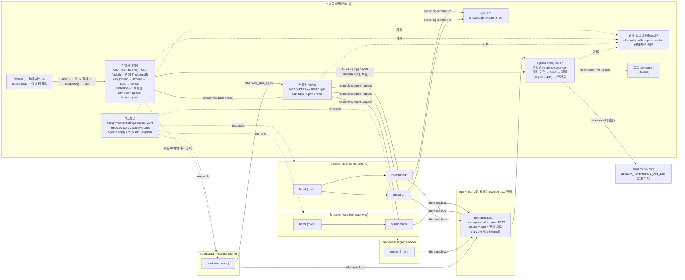

# RFA MAS — NemoClaw 보안 그룹 운영층

> **한 줄 요약**: 에이전트 N개를 "보안팀이 승인할 수 있는 형태"로 운영한다. 샌드박스는 보안 그룹의 조합 단위이고,
> 채널(internal/external)별 검열 프로파일은 API 진입점 한 곳에서 정해져 세션으로 전파되며, 경계를 넘으면 안 되는
> 규칙은 전부 OpenShell 정책 층에 있다. 시스템 전체는 설정 파일 4개로 선언된다.
>
> **보안 주장**: 기밀 영역을 나가는 것은 자동 검열(규칙+LLM)을 통과한 텍스트뿐이며, 사람 결재는 게시 직전에 한 번 더
> 검사하고 거절 사유는 검열 규칙으로 되먹임된다.
>
> **역할 분담**: 이 저장소는 지식 서버(`POST /ask`)·개인 채팅·기밀 영역 샌드박스·검열·감사 로그·admission queue 를 맡는다.
> 대응 에이전트(desk, C)·결재 서버(A)·프런트는 상대 팀의 것이며 여기서는 [`tools/mock/`](tools/mock/) 목업으로만 존재한다.

## 문제 정의 → 기존 대안의 한계 → 해법

**문제.** 1인 사내 비서라도 실제로는 에이전트가 여럿이다(비서, 검열, 조사·벤치마크·요약 같은 task 에이전트).
위협은 외부 공격자가 아니라 **내 에이전트 자신**이다: 프롬프트 인젝션이나 오작동으로 사내 API에서 읽은 수치·프로젝트명·
연락처가 외부 LLM 호출이나 외부 목적지로 새어 나간다. 보안팀이 물어보는 것은 세 가지다. "어느 에이전트가 어디로
나갈 수 있는가", "외부 모델로 나가는 내용은 누가 검열하는가", "에이전트를 옮기거나 추가할 때 그 규칙이 유지되는가".

**기존 대안의 한계.**

| 대안 | 한계 |
| --- | --- |
| 샌드박스 1개에 모든 에이전트 | egress 정책이 가장 넓은 에이전트 기준으로 합쳐진다. 조사 에이전트의 사내 API 접근이 요약 에이전트에게도 열린다 |
| 에이전트당 샌드박스 1개 | NemoClaw 온보딩 3분/샌드박스, 메모리·정책 파일이 에이전트 수만큼 늘어 운영 불가. 정책 검토 대상이 N개 |
| 앱 내부 필터(프롬프트·코드 gate)만 | 에이전트가 우회하면 끝. 경계가 아니라 "권고"다. OpenShell 층에 없는 규칙은 보안팀이 승인할 수 없다 |
| NemoClaw 기본 사용 | 게이트웨이당 라이브 inference route 1개, 샌드박스 식별 헤더 없음, 응답 검열(DLP) 없음, 에이전트 이동 절차 없음 |

**해법 (이 저장소).**

1. **보안 그룹 = OpenShell preset 파일.** `deploy/nemoclaw/presets/sg-*.yaml`을 `nemoclaw <sb> policy add --from-file`로만
   적용하고, 컨트롤러가 `assignments.yaml`을 읽어 reconcile 한다. static(filesystem/process) 섹션은 baseline, network는 preset.
2. **샌드박스 = 보안 그룹 조합 단위.** 같은 egress 조합의 task 에이전트는 한 샌드박스에 `agents.yaml`(NemoClaw 선언형 manifest)로
   묶인다. 고정 에이전트 assistant/censor는 전용 샌드박스.
3. **채널 기반 검열 프로파일.** internal(로컬 Nemotron, 사내 API, 검열 없음) / external(hosted 모델, 요청·응답 검열 필수).
   프로파일은 채널 API 진입점 한 곳에서 결정되어 서명된 세션 마커로 전파된다.
4. **검열은 egress 경계에서.** 모든 샌드박스의 inference route가 호스트 egress-proxy(유일한 provider) 하나를 가리키고,
   프록시가 regex → LLM 2단계로 redact(기본)·block·fail-closed 한다. censor LLM은 egress 0 + 로컬 inference.
5. **브로커 경유 호출.** assistant는 managed MCP(또는 REST 폴백) `ask_task_agent(name, query)` 하나로 같은/다른 샌드박스를
   구분하지 않고 위임한다. 세션의 채널이 task 에이전트의 inference에도 그대로 적용된다.
6. **에이전트 = 이식 가능한 번들.** 정의(agents.yaml 항목 + 스킬) + 상태(workspace, agents/<id>). 격상은 상태 포함 이동,
   격하는 censor 스캔(또는 비우기) 후 이동, 이동 전 브로커 drain.
7. **지식 서버 계약 `POST /ask` 하나.** desk(대응 에이전트)가 질문·스레드·거절 이력을 보내면 `ask()` 한 함수가
   head(어느 task·에이전트에 무엇을 물을지) → 브로커(샌드박스 안 task 에이전트) → 검열(audience 프로파일 + 되먹임 사유)을
   수행한다. `audience`(public/company/self)가 검열 프로파일을 정하는 유일한 분기이고, 개인 채팅 CLI/웹·데모도 같은 함수를 쓴다.
   외부 입력(스레드·거절된 초안)은 `<external_input>` 태그로 감싸 데이터로만 전달되고, 사람의 거절 사유는
   `censor-rules/learned.yaml` 에 누적되어 다음 요청의 검열 LLM·head 에 주입된다. 슬롯이 없으면 `202 queued` → 폴링.

## 아키텍처



경계 원칙: 외부 목적지는 어떤 샌드박스도 직접 못 나간다(baseline의 `nvidia`·`clawhub`·`openclaw_api`·`openclaw_docs`·
`npm_registry`를 모든 샌드박스에서 `policy exclude`). 프록시 장애 = 전 샌드박스 inference 정지이므로 `make demo`는 시작 시
프록시 헬스체크를 한다.

## 설정 4개로 선언되는 시스템

| 파일 | 역할 | 소비자 |
| --- | --- | --- |
| [`deploy/nemoclaw/assignments.yaml`](deploy/nemoclaw/assignments.yaml) | 보안 그룹(preset 목록·privilege) → 샌드박스(그룹 조합) → 에이전트(그룹 또는 고정 샌드박스, alias, 스킬, tools) | 컨트롤러(reconcile, manifest 생성), 브로커, 재배치 |
| [`deploy/nemoclaw/routing.yaml`](deploy/nemoclaw/routing.yaml) | 채널 → alias → 백엔드(로컬 Ollama / build.nvidia.com), 프록시·브로커·진입점 listener, route 모드 | egress-proxy, 진입점, 전환 스크립트 |
| [`deploy/nemoclaw/censors.yaml`](deploy/nemoclaw/censors.yaml) | 검열 프로파일: regex 규칙(redact/block) → LLM 분류(runner, timeout, fail-closed). `external`(프록시), `public`(/ask public: external 규칙 + 미공개 일자), `internal`(company/self) | 프록시(요청·응답), `/ask`·개인 채팅 최종 knowledge, 격하 스캔 |
| [`deploy/nemoclaw/ask.yaml`](deploy/nemoclaw/ask.yaml) | `/ask`: audience → 검열 프로파일·라우팅 채널(유일한 분기), admission queue(max_inflight/max_queue/180초), 계보 거절 한도, head runner, task 카탈로그, bearer(`RFA_ASK_TOKEN`, .env.dev) | 진입점 `ask()`, 개인 채팅, 목업 desk |
| [`deploy/nemoclaw/censor-rules/learned.yaml`](deploy/nemoclaw/censor-rules/learned.yaml) (호스트 파일, 자동 누적) | 되먹임된 거절 사유 `{audience, task, reason, at}` — 검열 LLM 단계 hint + head 프롬프트 "이전 거절 사유" | `ask()` (마운트 대신 요청 본문으로 샌드박스 밖에서 주입) |

`assignments.yaml` 발췌:

```yaml
security_groups:
  egress-none:   { privilege: 0, presets: [] }
  intranet-ro:   { privilege: 1, presets: [sg-intranet-ro] }
  control-plane: { privilege: 2, presets: [], mcp_servers: [broker], fallback_presets: [sg-control-plane] }
sandboxes:
  rfa-censor:         { groups: [egress-none], fixed: true }
  rfa-tasks-none:     { groups: [egress-none] }
  rfa-tasks-intranet: { groups: [intranet-ro] }
  rfa-assistant:      { groups: [control-plane], fixed: true }
agents:
  research:  { kind: task, groups: [intranet-ro], alias: rfa-external, skill: task-research, tools: { allow: [read, exec] } }
  benchmark: { kind: task, groups: [intranet-ro], alias: rfa-internal, skill: task-benchmark, tools: { allow: [read, exec] } }
```

`routing.yaml` 발췌:

```yaml
proxy:   { bind: 0.0.0.0:8797, route_url: http://host.openshell.internal:8797/v1, default_mode: rfa-auto, unattributed_alias: rfa-internal }
aliases:
  rfa-internal: { backend: ollama, model: nemotron-3-nano:4b,               censor: none,     exposure: 0 }
  rfa-external: { backend: build,  model: nvidia/nemotron-3-super-120b-a12b, censor: external, exposure: 1 }
  rfa-censor:   { backend: ollama, model: nemotron-3-nano:4b,               censor: bypass,   exposure: 0 }
channels:
  internal: { alias: rfa-internal, profile: none }
  external: { alias: rfa-external, profile: external }
```

`censors.yaml` 발췌:

```yaml
profiles:
  external:
    stages:
      - { id: regex, type: regex, rules: [{ id: money-krw, pattern: '\d{1,3}(?:,\d{3})+\s*(?:원|KRW)', replacement: '[REDACTED:amount]' },
                                          { id: credential, pattern: '(?i)(?:bearer|nvapi-|sk-)[A-Za-z0-9._-]{12,}', replacement: '[REDACTED:credential]', action: block }] }
      - { id: llm, type: llm, runner: direct, sandbox: rfa-censor, alias: rfa-censor, timeout_seconds: 45, on_error: block }
```

## 실행

```bash
make bootstrap   # 검증 → 프록시/브로커/진입점 기동 → 사내 API 기동 → (rfa-demo 폐기) → 샌드박스 4개 순서 온보딩 → reconcile → 워크스페이스 시드
make demo        # demo/01..09 (기본 --replay; DEMO_MODE=live 로 라이브 실행, 실패·예산 초과 시 자동으로 기록 재생)
make mock-e2e    # desk(C)/결재(A) 목업으로 /ask 시나리오 4개 — 기본 --fake-agents(샌드박스·모델 없이 계약·루프 검증)
make mock-e2e MOCK_FLAGS="--ask-url http://127.0.0.1:8799"   # 같은 시나리오를 라이브 서버(실제 head·브로커·샌드박스)에
make teardown    # 선언된 샌드박스 destroy, 호스트 서비스 정지
```

**`/ask` 계약과 목업.** 계약은 [`docs/api/ask.openapi.yaml`](docs/api/ask.openapi.yaml)(생성물, `make openapi`)이다:
`POST /ask {request_id, question, channel(github|slack), audience(public|company), target, url, requester, context[], feedback[]}` →
`200 {request_id, knowledge, task|null, refusal{code: no_task|blocked_by_policy|no_knowledge|queue_full}|null, censor{profile, verdict, redactions[{reason}]}}`
또는 `202 {status: queued, position}` → `GET /ask/{request_id}`. 같은 `request_id` 는 캐시 응답, 처리 타임아웃 180초(→ `no_knowledge`/"timeout"),
같은 계보(target 또는 request_id prefix)에서 거절 3회면 `blocked_by_policy`. 개인 채팅은 `POST /chat`(audience self) 또는
`python -m rfa_mas.nemoclaw chat "질문"`. [`tools/mock/desk.py`](tools/mock/desk.py)(C 목업: 시나리오 → /ask → 템플릿 초안 → 결재 → 거절이면
feedback 붙여 재요청, 최대 3회)와 [`tools/mock/approval.py`](tools/mock/approval.py)(A 목업: `--auto reject-if-regex` 또는 `tools/mock/rfa-mock approve|reject <id> --reason`)가
[`tools/mock/scenarios/`](tools/mock/scenarios/) 4개(① 공개 정상 ② 미공개 일자 → redact ③ 스레드 인젝션 ④ 거절 → feedback → 재요청)를 돌린다.

데모: 01 외부 curl 차단 · 02 보안 그룹 변경 · **03 개인 채팅 자동 마스킹(self) vs public** · **04 되먹임(거절 사유 → learned.yaml → 다음 /ask)** ·
**05 인젝션 차단(`<external_input>`)** · **06 admission queue(202 → 폴링 → 200, 멱등)** · 07 `agents apply` 런타임 추가 · 08 격하 이동 스캔 · 09 external 채널 마스킹(프록시).

**대시보드에서 바로 테스트**: <http://127.0.0.1:8799/audit/> 상단 "테스트 실행" 패널에서 채널(internal/external)·대상(assistant / 각 task 에이전트 / proxy)을 고르고
[`deploy/nemoclaw/samples.yaml`](deploy/nemoclaw/samples.yaml)의 샘플 질문을 선택해 실행한다. 응답·verdict·마스킹 수·alias/백엔드·소요 시간이 표시되고,
같은 화면 아래 감사 로그에 모든 hop(channel → broker → inference)이 남는다. 샘플이 참조하는 사내 지식은
[`deploy/nemoclaw/kb/sg_kb_seed.jsonl`](deploy/nemoclaw/kb/sg_kb_seed.jsonl)을 `make kb-seed`(bootstrap 에 포함)로 knowledge facade 의 KB 에 넣는다(합성·public).

컨트롤러 명령(`python -m rfa_mas.nemoclaw …`, 또는 스킬 [`nemoclaw-security-groups`](deploy/nemoclaw/skills/nemoclaw-security-groups/SKILL.md)):
`validate` · `render` · `plan` · `apply` · `status` · `verify-baseline` · `explain` · `seed` · `bootstrap` · `teardown` ·
`switch-route <mode> [--force-openshell]` · `serve [--replay] [--fake-agents]` · `chat "<질문>" [--fake-agents]` · `relocate <agent> --to-groups … [--wipe]` ·
`requests sync|list|approve|deny` · `audit [--kind ask]`. 감사 로그 화면: <http://127.0.0.1:8799/audit/> (대상 `ask:self` / `ask:public` 으로 같은 `ask()` 를 실행). `/ask` 문서: <http://127.0.0.1:8799/docs>.

## NVIDIA Agent 기술 사용 기능 체크리스트

| 사용 기능 | 어디에 | 상태 |
| --- | --- | --- |
| OpenShell 정책: static(filesystem/process)은 baseline, network_policies는 preset | [baseline/openclaw-sandbox.yaml](deploy/nemoclaw/baseline/openclaw-sandbox.yaml) · [presets/sg-intranet-ro.yaml](deploy/nemoclaw/presets/sg-intranet-ro.yaml) · [presets/sg-control-plane.yaml](deploy/nemoclaw/presets/sg-control-plane.yaml) · `verify-baseline`([controller.py](src/rfa_mas/nemoclaw/controller.py)) | 구현 |
| NemoClaw CLI: onboard(--agents, --non-interactive), policy add/remove/get, agents apply, snapshot, status, logs | [bootstrap.py](src/rfa_mas/nemoclaw/bootstrap.py)(onboard·snapshot·destroy) · [controller.py](src/rfa_mas/nemoclaw/controller.py)(policy add/remove/exclude/get, agents apply, explain) · [requests.py](src/rfa_mas/nemoclaw/requests.py)(logs) · [Makefile](Makefile)(status) | 구현 |
| OpenClaw agents.yaml: main + secondary, tools.allow/deny, subagents.allowAgents, defaults.maxSpawnDepth | [manifests.py](src/rfa_mas/nemoclaw/manifests.py) → [agents/rfa-tasks-intranet.agents.yaml](deploy/nemoclaw/agents/rfa-tasks-intranet.agents.yaml) (NemoClaw `validateExtraAgents`로 검증) | 구현 |
| managed MCP: 브로커를 MCP 서버로 등록, 사내 API 자격증명은 샌드박스 밖 | [broker.py](src/rfa_mas/nemoclaw/broker.py) (Streamable HTTP) · `mcp add --url https://<lan-ip>:8798/mcp --env RFA_BROKER_MCP_TOKEN --trusted-private-host`([controller.py](src/rfa_mas/nemoclaw/controller.py)) · 로컬 CA·IP SAN 인증서·`NEMOCLAW_CORPORATE_CA_BUNDLE`([bootstrap.py](src/rfa_mas/nemoclaw/bootstrap.py)) · REST 폴백 [presets/sg-control-plane.yaml](deploy/nemoclaw/presets/sg-control-plane.yaml) | 구현 (라이브 결과는 아래 "검증 상태") |
| inference 라우팅: 채널별 프로바이더 분리, 재시작 없는 전환 스크립트 | [routing.yaml](deploy/nemoclaw/routing.yaml) · [proxy.py](src/rfa_mas/nemoclaw/proxy.py) · [routes.py](src/rfa_mas/nemoclaw/routes.py)(`nemoclaw inference set` 우선, `openshell inference set`은 `--force-openshell`로만) | 구현 |
| build.nvidia.com을 external 채널 모델로, 키는 host env `NVIDIA_INFERENCE_API_KEY` → OpenShell provider store | 온보딩 env([bootstrap.py](src/rfa_mas/nemoclaw/bootstrap.py)) · 프록시 상류 [routing.yaml](deploy/nemoclaw/routing.yaml) `backends.build` (`.env.dev` 0600·git-ignore 검증) | 구현 |
| Skills: (a) task 에이전트별 SKILL.md (b) 컨트롤러 `nemoclaw-security-groups` 스킬 | [skills/task-research](deploy/nemoclaw/skills/task-research/SKILL.md) · [task-benchmark](deploy/nemoclaw/skills/task-benchmark/SKILL.md) · [task-summarizer](deploy/nemoclaw/skills/task-summarizer/SKILL.md) · [censor](deploy/nemoclaw/skills/censor/SKILL.md) · [sg-assistant](deploy/nemoclaw/skills/sg-assistant/SKILL.md) · [nemoclaw-security-groups](deploy/nemoclaw/skills/nemoclaw-security-groups/SKILL.md) (`skill install`/workspace upload, [bootstrap.py seed_sandbox](src/rfa_mas/nemoclaw/bootstrap.py)) | 구현 |
| 차단 요청 approve/deny 흐름(CLI) | [requests.py](src/rfa_mas/nemoclaw/requests.py): OCSF DENIED 수집 → `sg-approved-<id>` preset → `policy add`; `openshell term`은 대안 | 구현 |
| Explain Network Policy to Agents | `policy explain --write` 후 `POLICY.md`를 스킬이 참조([controller.py](src/rfa_mas/nemoclaw/controller.py), [sg-assistant SKILL](deploy/nemoclaw/skills/sg-assistant/SKILL.md)) | 구현 |

## NemoClaw 로드맵/이슈에 없는 기능

- **보안 그룹 추상화** (샌드박스 = 그룹 조합, preset 파일 reconcile): NemoClaw는 preset을 샌드박스 단위로 수동 add/remove 한다.
  선언형 배치·조합·drift 감지는 없다. 관련: [#2853](https://github.com/NVIDIA/NemoClaw/issues/2853) (선언형 다중 에이전트 manifest,
  closed — 에이전트 roster까지만 다루고 정책 배치는 다루지 않음), [#10904](https://github.com/NVIDIA/NemoClaw/issues/10904)
  (온보딩 입력을 선언형 설정 하나로, open).
- **채널 기반 검열 프로파일** (egress 경계에서 요청·응답 redact/block, 세션 전파): NemoClaw의 inference route는 credential 주입만 하고
  내용을 검사하지 않으며 Supervisor middleware는 문서에 노출되지 않는다. 관련: [#566](https://github.com/NVIDIA/NemoClaw/issues/566)
  (MCP 자격증명 경계 — 내용 검열 아님).
- **에이전트 재배치 정책** (격상 상태 포함·격하 스캔·브로커 drain): `snapshot restore --to`는 샌드박스 전체 복제뿐이며
  에이전트 단위 이동·검열 스캔은 없다. 관련: [#11763](https://github.com/NVIDIA/NemoClaw/issues/11763) (NemoClaw-only 제한을
  OpenShell 밖에 두지 말 것, open — 이 저장소는 경계 규칙을 OpenShell 층에만 두고 agents.yaml/브로커는 세분화·감사용으로만 쓴다).

## 실측으로 확인한 제약과 대응

| 확인 사실 (2026-09-27, NemoClaw 0.0.124 / OpenShell 0.0.116) | 대응 |
| --- | --- |
| 게이트웨이는 요청의 `model`을 라이브 route 모델로 덮어쓰고 샌드박스 식별 헤더가 없다 | HMAC 서명 in-band 마커([markers.py](src/rfa_mas/nemoclaw/markers.py)): 진입점이 세션 메시지에, 컨트롤러가 각 workspace `IDENTITY.md`에. 위·변조 마커는 무시하고 최소 노출 alias를 택한다 |
| 같은 게이트웨이의 샌드박스가 다른 model을 기록하면 `inference set`이 `provider-model` 충돌로 거부 | 모든 샌드박스는 route `rfa-auto` 하나를 기록; 채널 구분은 마커, route 모델명은 전체 모드(kill switch) |
| `inference set --endpoint-url`은 사설 IP를 거부 | 문서화된 `http://host.openshell.internal:<port>` 경로 사용 (Colima에서 192.168.5.2 = 호스트) |
| managed MCP는 HTTPS + 사설 IP SAN 인증서 + 온보딩 시 CA 번들 요구 | bootstrap이 로컬 CA를 만들고 `NEMOCLAW_CORPORATE_CA_BUNDLE`로 온보딩; 실패 시 REST preset 폴백 |
| `~/.nemoclaw/credentials.json`은 legacy이며 현재 릴리스는 만들지 않음 | 키는 host env → OpenShell provider store; 프록시 상류 키는 0600·git-ignore 파일 |
| 4B 로컬 모델이 OpenClaw 시스템 프롬프트(수천~2만 토큰)를 매 턴 처리하면 60초 이상 | 검열 LLM 단계는 `runner: direct`(5초 실측), `NEMOCLAW_MINIMAL_BOOTSTRAP=1`, internal 데모는 단순 조회 1개 |

## 검증 상태 (보안 그룹 층)

이 절은 `make bootstrap && make demo`의 실제 결과로 갱신한다. 단위 테스트: `make test`
(`tests/test_sg_controller.py` 컨트롤러 reconcile, `tests/test_censor.py` regex/LLM/fail-closed, `tests/test_broker.py` 브로커 라우팅,
`tests/test_egress_proxy.py` 프록시, `tests/test_sg_ops.py` 승인·재배치·스캔).

**2026-09-27 21:00 KST 기준 라이브 결과** (host 16 GiB, Colima 4 vCPU/8 GiB, NemoClaw 0.0.124, OpenShell 0.0.116):

| 항목 | 결과 |
| --- | --- |
| 단위 테스트 `make test` | 70 passed (컨트롤러 14, 검열 11, 프록시 12, 브로커 7, ops 5, 진입점 3, /ask 및 mock e2e 18) |
| `make mock-e2e` (fake agents: 키워드 head·KB 시드 task·regex+hint judge, 샌드박스·모델 없음) | 4/4 PASS — ① allow/1라운드 ② redact(date·amount)/1라운드 ③ canary 없음/injection_flags 기록 ④ 1라운드 거절(사내 주소) → learned.yaml → 2라운드 승인, 같은 사유 재발 없음 |
| 라이브 `POST /ask` 실호출 (`make serve`, audience public) | 200/58~160초. head(direct: egress-proxy → 로컬 Ollama)가 `triv3`/`research` 를 근거 문장과 함께 선택(≈43초). 브로커의 `nemoclaw rfa-tasks-intranet agent --agent research` 턴은 OpenClaw 게이트웨이 미기동으로 150초 timeout → `refusal no_knowledge "task agent failed"`, 감사 kind=ask/broker 에 error 기록(fail-closed, 빈 knowledge) |
| `make mock-e2e MOCK_FLAGS="--ask-url http://127.0.0.1:8799"` (라이브 head·브로커·샌드박스, 2026-09-27 20:57) | 0/4 — 네 시나리오 모두 head 는 task 를 골랐으나 샌드박스 턴 실패로 `refusal no_knowledge`(빈 knowledge, 결재 제출 없음; 149~226초). 01 은 앞선 요청이 처리 중이라 `202 queued` → 폴링 446회 후 200 으로 admission queue 경로가 라이브로 확인됨. 원인은 위 메모리 문제 + `rfa-tasks-intranet` 미reconcile |
| 데모 03~06 (`ask()` 데모) | `serve --fake-agents` 진입점(RFA_ENTRY_URL, RFA_FAKE_TASK_DELAY=3)에 대해 4/4 PASS(03 self 이메일만 마스킹·public 은 프로젝트명·수치까지 / 04 1라운드 거절 → learned.yaml → 2라운드 승인, 감사 hints=1 / 05 canary 없음, injection_flags=['context[1]'] / 06 202 position 1 → 폴링 3회 → 200, 멱등 캐시). 라이브 샌드박스 기록(`demo/replay`)은 아래 조건 해소 후 |
| 온보딩 `nemoclaw onboard --agents … --non-interactive` (provider=custom → egress-proxy, tier=restricted) | `rfa-censor` 263초, `rfa-tasks-none` 155초 완료. `rfa-tasks-intranet` 컨테이너 생성 후 세션 in_progress(메모리 부족으로 호스트가 bootstrap 종료). `rfa-assistant`·managed MCP 등록 미실행 |
| reconcile (`policy exclude` ×5, `policy explain --write`, IDENTITY·skill 시드) | rfa-censor, rfa-tasks-none 적용 완료 |
| 샌드박스 → inference.local → egress-proxy | 온보딩 검증 요청과 `curl` probe 가 프록시에 도달(자격증명은 OpenShell 이 주입, 미귀속 → rfa-internal → Ollama 5~6초) |
| egress-proxy 검열 (대시보드 샘플) | external: 요청 마스킹 8건 후 hosted Nemotron super-120b 응답 49초, verdict allow / credential: regex block 14ms(상류 전송 없음) / internal: 로컬 5.8초 마스킹 없음 |
| 검열 LLM 단계 (direct, rfa-censor alias → 로컬) | JSON 분류 5~13초, verdict redact 확인 |
| KB 시드 → knowledge facade | 10건 입력, `POST /tasks/triv3/ask` 가 새 노트를 근거로 반환 |
| 샌드박스 안 OpenClaw 턴 (브로커 → summarizer) | **미확인**: Colima VM 메모리 소진(7.8/7.9 GiB, 샌드박스 3개 ×1.5~1.7 GiB + 유휴 Langfuse 컨테이너 12개)으로 OpenClaw 게이트웨이가 기동하지 못해 턴이 150초 timeout. `nemoclaw <sb> status` "agent delivery chain could not be proven" |
| 데모 라이브 기록 (`DEMO_MODE=live make demo`) | 미실행(위 메모리 문제 해소 후) — `--replay` 기록 없음 |
| managed MCP | 미시도(rfa-assistant 온보딩 전). 로컬 CA·IP SAN 인증서는 생성됨(`.local/sg/tls`) |

다음 실행 조건: Colima VM 여유 메모리 확보(유휴 Langfuse 스택 정지 또는 `colima start --memory 12`; 실측 샌드박스 3개 6.0 GiB + Langfuse 0.9 GiB / 7.7 GiB) 후
`make bootstrap`(중단 세션 자동 resume; `rfa-tasks-intranet` 은 아직 `sg-intranet-ro` preset·baseline exclude 미적용) → `make mock-e2e MOCK_FLAGS="--ask-url http://127.0.0.1:8799"` → `DEMO_MODE=live make demo`.

---

# RFA MAS (제품 코어 문서)
## 빠른 시작

필수 환경은 Python 3.12와 [uv](https://docs.astral.sh/uv/)다. 패키지 버전은 `uv.lock`에 고정되어 있다.

```bash
uv sync --locked      # 기본(mock/local) 설치. 모델 API key, GPU, Docker가 필요 없다
uv run rfa doctor     # 설정 변수 이름과 configured/missing 상태만 출력
uv run rfa demo       # 합성 TRIV3 공개 DRAFT, simulated=true
```

`.env`가 없어도 기본 mock/local 모드로 동작한다. 특정 설정 파일은 global option으로 subcommand 앞에 지정한다: `uv run rfa --env-file <파일> <command>`. 파일이 없거나 symlink·비정규 파일이면 기본값으로 fallback하지 않고 거절한다.

전체 테스트 환경은 NVIDIA Agent Toolkit(NAT) extra를 포함한다.

```bash
uv sync --locked --extra nat
uv run --extra nat python -m pytest -q
```

`python -m pytest`로 실행한다. `pytest` 실행 파일을 직접 쓰면 저장소 루트가 import 경로에 없어 `scripts.contract_baseline`을 import하는 test가 수집 단계에서 실패한다(2026-09-27 관측). extra 없이 `uv sync --locked`를 실행하면 환경이 기본 설치로 돌아가 NAT extra 패키지가 제거된다(2026-09-27 관측). 작업용 worktree에서는 `TASK_CONTROL_ROOT`를 canonical checkout 절대 경로로 지정한다. control 테스트를 임의로 제외해 전체 통과라고 보고하지 않는다.

통합 E2E 시나리오(E2E-01~10) 결과와 `rfa demo --full`은 P0-026이 작성하는 [docs/DEMO.md](docs/DEMO.md)를 본다. 현재 main에 통합되어 있다. 키 없는 전체 데모는 `uv run rfa demo --full`로 실행한다.

## 명령

아래는 2026-09-27 KST에 격리된 임시 데이터 디렉터리에서 실행해 확인한 명령이다. 설정은 `DATABASE_URL`, `TRACE_DIR`, `LOG_LEVEL` 등만 적은 합성 env 파일을 `--env-file`로 넘겼다.

| 명령 | 용도 | 관측 결과 |
| --- | --- | --- |
| `uv run rfa doctor` | 선택 mode 점검 | `ready=true`, missing 없음, external write/egress effective `false`. 값·일부 문자열·길이는 출력하지 않는다 |
| `uv run rfa demo` | TRIV3 공개 DRAFT | `completed`, `simulated=true`, 게시 `not_requested` |
| `uv run rfa demo --domain quantization_research --audience public` | 두 번째 도메인 | 위와 같음 |
| `uv run rfa demo --scenario insufficient_evidence` (`revision_requested`, `timeout`도 같음) | 결정적 검토 시나리오 | `waiting_approval`, exit 0 |
| `uv run rfa demo --scenario policy_denied` | 권한 거절 | `failed`/`policy_denied`, DRAFT 없음, exit 1(의도한 실패) |
| `uv run rfa api` | FastAPI, 기본 `127.0.0.1:8000` | `/healthz` 200, `/readyz` `ready`, `POST /v1/work` 201 `completed`, `GET /v1/work/{run_id}`와 `GET /v1/runs/{run_id}/status` 200, `/openapi.json` 200 |
| `uv run rfa scheduler --run-seconds 3` (`SCHEDULER_ENABLED=true`) | API와 별도 프로세스인 단일 owner 예약 runner | `scheduler_running`, exit 0. `SCHEDULER_ENABLED`가 false면 exit 2 `scheduler_disabled` |
| `uv run rfa evaluate --dataset persona-regression-v2 --label baseline --output <새 파일>` | 합성 persona 회귀(simulated) | P1-001E 보수 후 24/24 pass, 보안 실패 0(simulated). 과거 23/24 실패와 구분한다. 격리를 위해 `--env-file`은 거절된다 |
| `uv run rfa evaluate-compare --baseline <A> --candidate <B> --output <새 파일>` | 같은 조건의 두 실행 비교 | 실제 생성한 두 manifest만 비교. 과거 동일 코드 23/24 실행은 unchanged/release fail이었으며 현재 개선 측정과 혼합하지 않는다 |
| `uv run rfa openapi --output <경로>` | OpenAPI export | 41개 path |
| `uv run rfa init-env --output .env.dev` | 서비스별 로컬 내부 credential profile 생성 | 8개 변수 생성, 파일 권한 0600, 변수 이름만 출력. `NVIDIA_API_KEY`는 만들지 않는다. 저장소 루트의 `.env` 또는 git-ignore된 `.env.<profile>`만 허용한다 |

`doctor`와 `demo`는 `uv run`으로, 나머지는 같은 환경의 `rfa` console script로 실행했다. 시나리오 demo는 결정적 P0 시나리오이며 실제 외부 장애나 OpenShell 차단 증거가 아니다.

loopback 기본 모드의 작업 요청 예:

```bash
curl -sS http://127.0.0.1:8000/v1/work \
  -H 'Content-Type: application/json' \
  -d '{"query": "TRIV3 공개 트랙을 근거와 함께 요약해 줘.", "domain_id": "triv3", "target": {"audience": "public"}}'
```

`APP_HOST`를 loopback 밖으로 바꾸면 `APP_API_KEY`가 필수이고 작업 API에 `Authorization: Bearer`가 필요하다. 로컬 identity는 실사용 인증이 아니다. 전체 route는 생성된 OpenAPI(`GET /docs`, `GET /openapi.json`)가 기준이다.

## 옵트인 live 검증

기본 suite에서 live test는 skip되며 skip은 증거가 아니다. credential은 명시한 env 파일에서만 읽고 출력·저장하지 않는다. `NVIDIA_API_KEY`는 `.env.dev` 같은 비공개 profile에 직접 넣는다.

2026-09-27 KST에 아래 두 명령을 합성 자료로 각 1회 실제 실행했다(n=1).

```bash
# P1-002: 제품 ModelPort 경로 -> hosted NVIDIA chat completions
RFA_NVIDIA_LIVE=1 RFA_NVIDIA_ENV_FILE=/abs/path/.env.dev \
RFA_NVIDIA_PRODUCT_EVIDENCE_OUT=/tmp/p1002-product-live.json \
  .venv/bin/python -m pytest -q tests/integration/test_nvidia_product_live.py

# P1-003: 제품 Research 경로 -> 공식 nemo-retriever Skill CLI 26.8.1(hosted embedding)
RFA_RETRIEVER_PRODUCT_LIVE=1 RFA_NVIDIA_ENV_FILE=/abs/path/.env.dev \
RFA_RETRIEVER_BIN=/abs/path/nemo-retriever-26.8.1/.venv/bin/retriever \
RFA_RETRIEVER_PRODUCT_EVIDENCE_OUT=/tmp/p1003-product-live.json \
  .venv/bin/python -m pytest -q tests/integration/test_retriever_product_live.py
```

| 실행 | 결과(n=1) |
| --- | --- |
| P1-002 제품 모델 경로 | 1 passed. HTTP 시도 1회, 모델 호출 29.8초, Run 30.3초, `completed`. 합성 공개 노트만 전송했고 owner 전용 노트·canary는 보내지 않았다. [모델 증거](docs/evidence/nvidia-model.md) |
| P1-003 제품 Research 경로 | 4 passed(11.25초). 합성 PDF 2개 ingest 7.17초, Research run 3.9초, Skill 결과 3개 반환·3개 사용·0개 unmapped, 관측 mode `real`. [제품 Skill 증거](docs/evidence/nvidia-skill-product.md)에 기록했다 |

다른 opt-in live test는 이번 문서 작업에서 다시 실행하지 않았다. 조건과 결과는 각 evidence 문서에 있다: `tests/integration/test_nvidia_live.py`(P1-002A, [모델 증거](docs/evidence/nvidia-model.md)), `tests/integration/test_retriever_live.py`(P1-003A, [Skill 증거](docs/evidence/nvidia-skill.md)), `tests/integration/test_langfuse_live.py`(P1-006C, 로컬 self-host Langfuse 필요, [LLMOps 증거](docs/evidence/llmops.md)), `tests/integration/test_openshell_live.py`(P1-007C, OpenShell gateway와 rootfs 필요, [OpenShell 증거](docs/evidence/openshell.md)).

## 현재 인수 결과

| 경로 | 실제 결과 | 한계 |
| --- | --- | --- |
| `demo --full` + controlled/API·프로세스·부하 | worker/main 각각 75 passed, 실패·skip 0 | 모델/검토/게시는 mock; 전체 real E2E 아님 |
| Ultra 4096, E2E-02/06/08 ×3 | 9/9 완료, 각각 30초 이내, 금지 outbound marker 0 | 공개 합성 자료; E2E-06/08 semantic quality not_run |
| Lightning 1024 / 4096 | 7/9 / 8/9 완료, 지연 기준 실패 | 실패 삭제·임계값 완화 없음 |
| UI | 실제 Chrome 기본 세션·저장·수동 mock 승인·재개 smoke 통과 | 전체 10개 UI 시나리오 아님 |

재현 명령·원시 지연·코드/fixture 버전·실제/모의 경계는 [최종 보고서](docs/evidence/e2e-final.md)에 있다. 모델 비교 결과만으로 사용자 `.env.dev`나 기본 provider를 변경하지 않았다.

## 아키텍처

```text
client / 로컬 UI (P0-025A)
  -> FastAPI (api/app.py): 설치 owner 인증, 도메인 오류 -> HTTP 변환
    -> application: WorkService, Supervisor graph, 공통 Domain TaskGraph, TeamRunner,
       DraftLifecycle, 세션/KB/예약/피드백 서비스, 효과 ledger
      -> ports (async Protocol): Model, Retrieval, Response, Tool, Runtime, Policy,
         Trace, WorkRepository
        -> adapters (bootstrap.py에서만 선택·주입)
           mock.py | local.py (SQLite, LocalRuntime, LocalPolicy, JSONL trace)
           http.py (Response/Publication/Tool/Runtime/Policy reference HTTP)
           nvidia.py | nemo_retriever.py | langfuse.py | scheduler.py | checkpoints.py
```

- 호출 방향은 `API -> application/graph -> port`다. graph node는 URL, 인증 header, MCP SDK, OpenShell CLI를 모르고 mock/real 분기를 하지 않는다.
- 선택한 실제 backend가 준비되지 않으면 `configuration_error` 또는 `not_implemented`로 실패하며 mock으로 fallback하지 않는다.
- cloud 모델에는 public 근거만 보낸다. P1-005 screen이 먼저 거르고, P1-002의 public-only gate가 한 번 더 확인한다.
- 팀원 모듈 자리를 채우는 로컬 stand-in이 있다: P1-008C 검토·게시·READ tool 서비스(`src/rfa_mas/reference/local_response*.py`), P1-008D runtime 서비스(`src/rfa_mas/reference/local_runtime*.py`), P0-025A UI(`src/rfa_mas/ui/`). 교체 방법은 [docs/INTEGRATION.md](docs/INTEGRATION.md)의 "로컬 stand-in 교체"를 본다.

## 실제 vs mock/local

| 구성요소 | 기본 실행(키 없음) | 선택 가능한 실제 경로 | 실제로 실행한 증거 | 아직 아닌 것 |
| --- | --- | --- | --- | --- |
| 모델 | `MockModel`(simulated) | `MODEL_PROVIDER=nvidia` -> `NvidiaChatModel` | hosted Nemotron 합성 호출(P1-002A), 제품 경로 live n=1(P1-002) | 대표 Ultra 9회 결과는 아래 보고서; 일반 품질·지연 보장은 아님 |
| 공식 Skill(NeMo Retriever) | 없음 | `RETRIEVER_BACKEND=nemo_cli` -> Research 팀 source_scout의 Skill 도구 | CLI 26.8.1 direct 실행(P1-003A), 제품 Research 경로 live n=1(P1-003) | `nemo_service`(reserved), local embedding NIM, Skill 결과를 DRAFT 근거로 결합 |
| KB·검색 | `LocalRetrieval`: SQLite, 권한 확인 뒤 한국어 BM25 | 없음 | offline test(real local) | 외부 벡터 검색 |
| 검토·승인 | `MockResponse` | `RESPONSE_BACKEND=http` -> reference fixture 또는 P1-008C stand-in | stand-in 계약 test(local, receipt mode=mock) | 팀원 Response 서비스(P1-008A) |
| 게시 | `MockPublisher`(메모리 sink) | `PublicationHttpAdapter` -> stand-in의 local-artifact receipt | 계약 test(mode=mock) | 실제 외부 게시(P0에서 금지) |
| Tool | 팀 역할은 `LocalAnalysisTools`(READ 계산). `TOOL_BACKEND`의 ToolPort는 Work 경로에서 호출하지 않는다 | `TOOL_BACKEND=http`(reference) | 계약 test | MCP 실행, WRITE |
| Runtime | `LocalRuntime`(process-local) | `RUNTIME_BACKEND=http` -> P1-008D stand-in | 계약 test | OpenShell 위 RFA 역할 실행(P1-007B), 팀원 runtime(P1-008B) |
| OpenShell | 사용 안 함 | 없음 | 로컬 standalone OpenShell v0.1.1에서 stand-in 역할별 허용·차단(P1-007C) | RFA 제품 경로 |
| NemoClaw | 사용 안 함 | 없음 | NemoClaw 지원 OpenClaw sandbox → 제한된 host RFA API 실제 실행 n=1(P1-007A) | RFA backend는 sandbox 밖; 역할 identity 연결은 별도 |
| Policy | `LocalPolicy`(application policy) | `POLICY_BACKEND=http`(reference) | offline test | OS 수준 강제 |
| Trace | 로컬 JSONL + SQLite 관측 원장 | `TRACE_BACKEND=langfuse` + `LANGFUSE_EXPORT_ENABLED=true`(loopback) | 로컬 self-host Langfuse 4.46.0 export·ID 조회·ID 삭제(P1-006C) | P1-006F 앱 삭제 job/기존 live 6건 증거 있음; 비loopback 미지원 |
| 평가 | 규칙 평가(simulated, mock 모델) | NAT 1.8 installed smoke(P0-028, mock 공급자) | persona v2 24/24 pass/보안 0(simulated); 별도 NVIDIA Judge 합성 n=1(0.6) | E2E 전체 semantic quality와 실제 사용자 만족도 미검증 |
| 예약 | `SCHEDULER_ENABLED=false` | `rfa scheduler`(APScheduler, 별도 프로세스) | 3초 smoke, offline test | 예약 알림 생산자 |
| UI | 없음 | `rfa_mas.ui.app.create_local_ui_app`(P0-025A) | ASGI test와 실제 headless Chrome 기본 흐름([증거](docs/evidence/ui-smoke.json)) | 별도 UI 실행 CLI/전체 10개 UI E2E 없음; `rfa api`가 UI를 자동 mount하지 않음 |

## 해커톤 평가 기준 연결

공식 폼(AGENTS.md의 2026-09-24 KST 확인 기록)의 평가 항목에 이 저장소의 task와 증거를 연결한다. 폼은 항목별 배점이나 가중치를 공개하지 않았으므로 점수·가중치를 붙이지 않는다. 온라인 사전 챌린지 접수 마감은 **2026-09-28 23:59 KST**다. 2026-09-27 01:23 UTC 공식 폼 접근을 다시 시도했지만 Google 로그인 화면으로 이동해 본문을 확인하지 못했다. 최신 요건 대조는 미검증이며 P1-009의 잔여 blocker다. AGENTS.md의 기존 요건을 유지하고 미공개 배점은 추가하지 않는다.

| 평가 항목 | task | 증거 파일 | 상태 |
| --- | --- | --- | --- |
| NVIDIA Agent 기술 활용 심도: 실제 모델 | P1-002A, P1-002 | [nvidia-model.md](docs/evidence/nvidia-model.md) | real: hosted Nemotron 합성 호출, 제품 경로 n=1 |
| NVIDIA Agent 기술 활용 심도: Skill | P1-003A, P1-003 | [nvidia-skill.md](docs/evidence/nvidia-skill.md), `tests/integration/test_retriever_product_live.py` | real: 공식 CLI direct 실행, [제품 Research 경로 n=1](docs/evidence/nvidia-skill-product.md) |
| NVIDIA Agent 기술 활용 심도: OpenShell | P1-007C, P1-007B | [openshell.md](docs/evidence/openshell.md) | real(로컬 standalone, stand-in 역할 정책). RFA 제품 경로 not_run |
| NVIDIA Agent 기술 활용 심도: NemoClaw | P1-007, P1-007A | [nemoclaw.md](docs/evidence/nemoclaw.md) | real n=1: 지원 OpenClaw sandbox → host 제한 API; RFA core 격리와 다름 |
| NVIDIA Agent 기술 활용 심도: Agent Toolkit(NAT) | P0-027, P0-028 | [NAT_COMPATIBILITY.md](docs/NAT_COMPATIBILITY.md), `tests/test_nat_smoke.py` | NAT 1.8.0 installed offline smoke(mock 공급자). live 모델이나 runtime 격리 증거가 아님 |
| 실용성·산업 가치·혁신성 | P0-015, P0-020, P0-022~024, P1-001A/D, P1-005/005A/005B, P1-008 | [INTEGRATION.md](docs/INTEGRATION.md), [PRODUCT_REQUIREMENTS.md](docs/PRODUCT_REQUIREMENTS.md) | 권한 인지 비서, 근거 제한 DRAFT, 검토 후 게시, 예약, 피드백이 real(local)+mock으로 동작. 팀원 실서비스 미연결 |
| 완성도 | P0-021, P1-006B, P0-026, P1-009 | 이 README의 "검증 상태", [llmops.md](docs/evidence/llmops.md), [DEMO.md](docs/DEMO.md)(P0-026) | 현재 controlled 인수 75 passed(worker/main 각각), Persona24/24 simulated. 전체 real/UI gate는 보고서에서 분리 |
| 커스터마이징·독창성 | P1-004, P1-005, P0-021, P1-001D, P1-006E | [INTEGRATION.md](docs/INTEGRATION.md), [llmops.md](docs/evidence/llmops.md), `tests/test_redteam_regression.py` | 두 도메인이 공유하는 TaskGraph template, audience 라벨과 membership을 결합한 정책, cloud egress screen, 효과 ledger, 한국어 BM25, 레드팀 회귀 |

## 설정과 key 관리

`.env.example`가 설정 이름의 기준이며 `src/rfa_mas/settings.py`와 1:1로 대응한다. 실제 `.env`, 환경별 secret 파일, `.local/`, DB, 로그, 가상환경은 `.gitignore` 대상이다.

| Port | 서비스 | 설정 |
| ---: | --- | --- |
| 8000 | RFA Supervisor API | `APP_HOST`, `APP_PORT`, `APP_API_KEY` |
| 8001 | 통합 reference fixture | 테스트 전용 |
| 8011 | Response/Review | `RESPONSE_BASE_URL`, `RESPONSE_API_TOKEN` |
| 8012 | MCP/Tool gateway | `TOOL_BASE_URL`, `TOOL_API_TOKEN` |
| 8013 | Agent Runtime | `RUNTIME_BASE_URL`, `RUNTIME_API_TOKEN` |
| 8014 | Policy decision | `POLICY_BASE_URL`, `POLICY_API_TOKEN` |
| 7670 | NeMo Retriever service boundary | `RETRIEVER_SERVICE_URL`, `NEMO_RETRIEVER_API_TOKEN` |
| 3000 | Self-hosted Langfuse(opt-in, loopback만) | `LANGFUSE_BASE_URL`, Langfuse key pair |

| 선택 | 직접 입력할 변수 | 현재 동작 |
| --- | --- | --- |
| 기본 loopback mock/local | 없음 | 기본값 |
| `APP_HOST`를 loopback 밖으로 변경 | `APP_API_KEY` | 작업 API에 bearer 인증 필요 |
| `MODEL_PROVIDER=nvidia` | `NVIDIA_MODEL`, `NVIDIA_API_KEY`(선택: `NVIDIA_BASE_URL`, 기본 hosted endpoint; `NVIDIA_MAX_OUTPUT_TOKENS`, 기본 1024) | 실제 adapter. 누락·잘못된 값은 해당 변수 이름의 `configuration_error`이며 mock으로 대체하지 않는다 |
| `RETRIEVER_BACKEND=nemo_cli` | `RETRIEVER_CLI_PATH`, `NVIDIA_API_KEY`, `RETRIEVER_INDEX_DIR`의 `index_manifest.json` | Research 팀의 Skill 도구. KB 검색은 로컬로 남는다. 비공개 표식이 있는 질의는 hosted embedding으로 보내지 않는다 |
| `RETRIEVER_BACKEND=nemo_service` | `RETRIEVER_SERVICE_URL`, `NEMO_RETRIEVER_API_TOKEN` | reserved: `not_implemented` |
| `RESPONSE_BACKEND=http` | `RESPONSE_BASE_URL`, `RESPONSE_API_TOKEN` | loopback만. 검토는 `ResponseHttpAdapter`, 게시는 `PublicationHttpAdapter` |
| `TOOL_BACKEND=http` | `TOOL_BASE_URL`, `TOOL_API_TOKEN` | loopback만. WRITE는 전송 전에 거절 |
| `RUNTIME_BACKEND=http` | `RUNTIME_BASE_URL`, `RUNTIME_API_TOKEN` | loopback만 |
| `POLICY_BACKEND=http` | `POLICY_BASE_URL`, `POLICY_API_TOKEN` | loopback만 |
| `TRACE_BACKEND=langfuse` | loopback `LANGFUSE_BASE_URL`, `LANGFUSE_PUBLIC_KEY`, `LANGFUSE_SECRET_KEY`, `LANGFUSE_EXPORT_ENABLED=true` | 로컬 trace를 유지하고 allowlist metadata만 OTLP로 export. 비loopback은 `not_implemented` |
| `SCHEDULER_ENABLED=true` | 없음 | `rfa scheduler` 실행 허용 |
| `ENABLE_JUDGE=true`, `JUDGE_PROVIDER=nvidia` | `JUDGE_MODEL`, `NVIDIA_API_KEY` | 실제 NvidiaJudge. 합성/공개 평가 입력만 허용하며 개인 context를 보내지 않는다 |

`uv run rfa init-env --output .env.dev`는 기존의 비어 있지 않은 값을 덮어쓰지 않고, 통신 구간마다 다른 내부 token과 Langfuse key pair를 생성해 권한 0600으로 저장한다. `NVIDIA_API_KEY`는 외부 발급값이라 생성하지 않는다. 기본 backend는 계속 mock/local이므로 이 명령만으로 외부 호출이 켜지지 않는다.

Raw Slack, GitHub, 메일 credential은 이 서비스에 두지 않는다. key/token은 graph state, prompt, checkpoint, AgentSpec, KB, outbound DTO에 넣지 않는다. 내부 service token은 통신 구간마다 다르며 서로 또는 `NVIDIA_API_KEY`와 재사용하지 않는다. `ALLOW_EXTERNAL_WRITES=true`는 권한을 부여하지 않으며 P0에는 실제 외부 게시 경로가 없다. 모든 provisional HTTP adapter는 loopback URL에만 연결하고 non-loopback URL은 `not_implemented`로 실패한다. 이는 팀원 live API 호환성을 검증했다는 뜻이 아니다.

## 로컬 상태와 trace

| 저장 위치(기본 `DATABASE_URL` 기준) | 내용 |
| --- | --- |
| `.local/rfa.db` | run, DRAFT 버전, 세션, KB source/revision, 효과 ledger, 게시 receipt, 예약, 피드백, event feed. migration 1~13 |
| `.local/rfa.db.checkpoints.sqlite` | LangGraph checkpoint(승인 대기 재개) |
| `.local/rfa.db.scheduler.sqlite` | APScheduler job store(`rfa scheduler` 전용) |
| `TRACE_DIR/rfa-observations-v1/` | 관측 metadata JSONL. DRAFT 본문, 근거 발췌, private 원문, secret은 넣지 않는다 |

장기 KB와 graph checkpoint는 저장 책임이 다르며 팀원 DB나 외부 승인 원본과 직접 공유하지 않는다. LangGraph checkpoint와 DB 사이의 원자성은 가정하지 않는다. 효과가 있는 호출은 효과 ledger에 먼저 기록하고, 결과를 모르는 호출은 조회로만 대사하며 자동으로 다시 실행하지 않는다.

## 한계

- 팀원 실제 Response/Runtime 서비스(P1-008A/B)는 연결하지 않았다. stand-in은 로컬 대체물이다.
- MCP tool 실행과 외부 채널 게시는 없다.
- OpenShell 위의 RFA 역할 실행(P1-007B)은 미검증이다. standalone OpenShell과 NemoClaw 제한 API 시연은 별도 실제 증거가 있다.
- 실제 Judge와 OSS Langfuse 보존 job은 구현·한정 검증했다. 비loopback Langfuse와 `nemo_service`는 미지원이다.
- 모델별 대표 합성 9회 비교는 소표본이다. 일반 성능·보안 보장이 아니며 Lightning 실패도 보존한다.
- production 인증, 멀티테넌시, 분산 queue는 없다. 단일 설치 owner 기준이다.
- 로컬 namespace, `LocalPolicy`, `LocalRuntime`은 OS sandbox나 OpenShell 검증이 아니다. mock 검토 승인은 실제 승인·게시 권한이 아니다.

## 검증 상태

초기 명령/전체 suite 기록은 `wip/stack` 260f394의 역사적 실행이다. 현재 main 인수 결과는 [최종 보고서](docs/evidence/e2e-final.md)와 아래 표를 기준으로 한다:

- 위 "명령" 표의 명령 전부(임시 데이터 디렉터리, 합성 env 파일).
- offline 전체 suite: 아래 "검증 기록" 참고.
- 두 opt-in live smoke(P1-002, P1-003), 각 n=1.

선택 구성으로 container를 만들 수 없을 때의 동작도 확인했다. `MODEL_PROVIDER=nvidia`에 key/model이 없으면 `/healthz`는 200, `/readyz`는 503 `configuration_error`(누락 변수 이름만)이고 작업 route는 503이다. readiness는 설정 preflight이며 provider를 probe하지 않는다.

개발 상태는 [TASKS.md](TASKS.md)의 생성 view, 명세와 검증 evidence는 `tasks/<ID>/task.yaml`에서 조회한다. 작업 운영은 [TASK_EXECUTION_RULES.md](TASK_EXECUTION_RULES.md), 계약과 교체 절차는 [docs/INTEGRATION.md](docs/INTEGRATION.md), 교육 과정 연결은 [docs/EDUCATION_MAPPING.md](docs/EDUCATION_MAPPING.md), 최종 인수 기준은 [E2E 시나리오 10개](RFA_E2E_Test_Scenarios_10_ko.md)다.

### 검증 기록

- 2026-09-27 05:44 KST: `uv run --extra nat --offline --frozen python -m pytest -q -p no:cacheprovider --ignore=tests/test_task_migration.py --ignore=tests/test_taskctl.py` → 1049 passed, 0 failed, 21 skipped(185.4초). skip 21개는 모두 opt-in live test(NVIDIA 5, Retriever 11, Langfuse 4, OpenShell 1)이며 증거가 아니다.
- 같은 시각 `pytest` 실행 파일로 직접 실행하면 `scripts` import 실패로 11개 test 파일이 수집 단계에서 오류가 났다. 그래서 위 명령은 `python -m pytest`를 쓴다.
