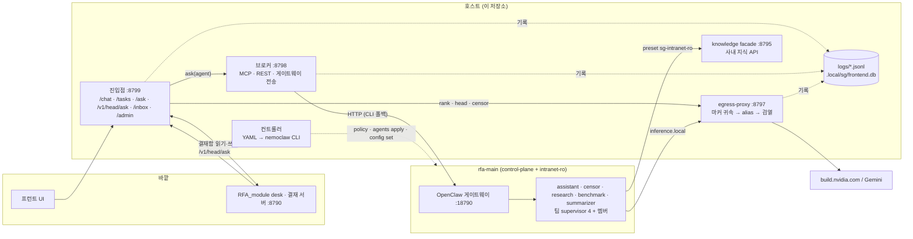
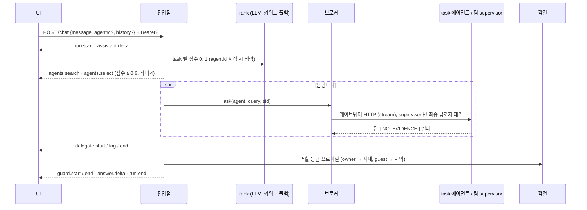
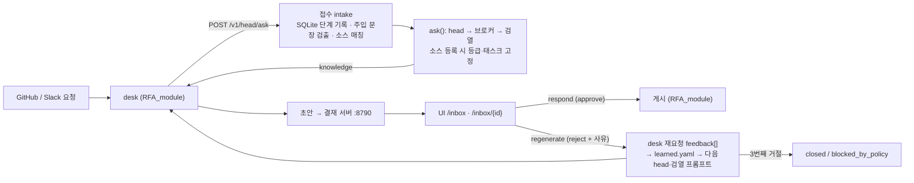
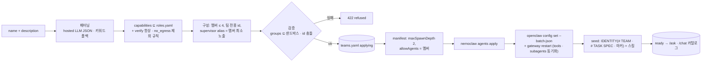

# RFA MAS 아키텍처

기준: main, 2026-09-28. 운영층(`src/rfa_mas/nemoclaw/`, `deploy/nemoclaw/`)만 다룬다. 코어층은 맨 끝에 짧게 적었다.
API 필드 정의는 [`openapi.yaml`](openapi.yaml)(프런트)과 [`api/ask.openapi.yaml`](api/ask.openapi.yaml)(desk)에 있고, 결정 이력은 [`decisions.md`](decisions.md)에 있다.

## 1. 기술 키워드

| 영역 | 키워드 |
| --- | --- |
| NVIDIA 스택 | NemoClaw 0.0.124 · OpenShell 0.0.116 · OpenClaw 2026.7.1 (관리 이미지) · build.nvidia.com hosted `nvidia/nemotron-3.5-lightning-30b-a3b` · NeMo Retriever Skill · NeMo Agent Toolkit(NAT) 1.8 |
| 샌드박스·정책 | OpenShell baseline(filesystem/process) + network preset · `policy add/exclude` · `policy explain` · 보안 그룹(egress-none / intranet-ro / control-plane) · 샌드박스 = 그룹 조합 · 기본 샌드박스 `rfa-main` 1개 |
| 에이전트 런타임 | OpenClaw `agents.yaml`(main + secondary) · `sessions_spawn` · `subagents.allowAgents` · `maxSpawnDepth 2` · tools `profile: coding` + deny · SKILL.md · IDENTITY.md · managed MCP · 게이트웨이 `/v1/chat/completions` |
| 추론 경로 | egress-proxy = 유일한 inference provider · `inference.local` → `host.openshell.internal:8797` · alias(`rfa-internal`/`rfa-external`/`rfa-censor`) · HMAC in-band 마커 · provider 전환(NVIDIA / Gemini) |
| 검열 | 프로파일(none/internal/public/external) · regex → LLM 2단계 · redact / block · `<external_input>` 태깅 · 되먹임 규칙 `learned.yaml` · 계보 거절 한도 3 |
| 서버 | FastAPI · SSE(`{type, runId, seq, ts, data}`) · Pydantic → OpenAPI 생성 · routes/services/store 3층 · SQLite · httpx · JSON-lines 로그(`app`/`audit`/`debug`) |
| 코어층 | LangGraph(StateGraph + interrupt + checkpoint) · port/adapter · 한국어 BM25 · knowledge facade · Langfuse(opt-in) |

## 2. 구성 요소

| 구성 요소 | 코드 | 핵심 |
| --- | --- | --- |
| 진입점 | `serve.py`, `routes/`, `services/`, `store/` | 모든 외부 API. loopback. owner/guest 판별, SSE, SQLite 상태 |
| `ask()` | `ask.py` | head(담당 선택) → 브로커(task 턴) → 검열. `/ask`·`/v1/head/ask`·`/chat/sync`·데모가 같은 함수를 쓴다 |
| 브로커 | `broker.py`, `session_wait.py` | `ask_task_agent(name, query, session_id)`. 같은/다른 샌드박스 차이를 숨기고 채널 마커를 다시 붙인다 |
| egress-proxy | `proxy.py`, `censor.py`, `markers.py`, `usage.py` | 샌드박스가 쓰는 유일한 LLM 경로. 귀속, alias 선택, 검열, 응답 정규화, 컨텍스트 사용량 측정 |
| 컨트롤러 | `controller.py`, `bootstrap.py`, `manifests.py`, `teams.py`, `relocate.py`, `requests.py` | 선언 → NemoClaw reconcile, 팀 생성, 재배치, 차단 요청 승인 |
| 감사 | `audit.py`, `logs.py` | `kind=ask·broker·inference·censor·team·admin·policy…`. 원문은 저장하지 않는다 |

### 선언 파일 (`deploy/nemoclaw/`)

| 파일 | 선언 내용 |
| --- | --- |
| `assignments.yaml` | 보안 그룹 → 샌드박스 → 에이전트(groups, alias, skill, tools) |
| `routing.yaml` | 채널 → alias → 백엔드, proxy·broker·entry listener, 브로커 전송 |
| `censors.yaml` | 검열 프로파일 단계(regex 규칙, LLM 판정) |
| `ask.yaml` | audience → 프로파일·채널, head(임계값 0.6, 최대 병렬 4), task 카탈로그, bearer |
| `roles.yaml` · `teams.yaml` · `task-specs/` | 팀 역할 카탈로그 / 상주 팀 4개 / supervisor 과제 명세 |
| `frontend.yaml` | UI 표시 메타(이름·아이콘·색·추천 질문) |
| `presets/` · `baseline/` · `skills/` · `kb/` | OpenShell 정책 / 에이전트 스킬 / 팀 KB(`t-*.jsonl`) |

## 3. 실제 흐름

### 3.1 채팅 — `POST /chat` (SSE)

- 담당이 없으면 비서가 직접 답한다. 근거 없는 사내 정보는 추측하지 않고 「알 수 없습니다」라고 답한다(D-13).
- 여러 담당의 답은 그 답들에 있는 사실만 합친다. owner 대화만 SQLite에 저장하고, guest는 `history`를 직접 보낸다(D-7).

### 3.2 결재 — RFA_module → `/v1/head/ask` → 결재함

- 결재 상태와 게시는 RFA_module 결재 서버가 맡는다. rfa_mas는 결재함 API에서 단계·검열 결과·소스 등급·담당 에이전트를 보태고, 쓰기는 owner만 할 수 있다(D-20).
- desk용 `POST /ask`(bearer)도 같은 `ask()`를 쓴다. 같은 `request_id`면 캐시된 결과를 돌려주고, 서버 타임아웃은 180초다.

### 3.3 태스크(팀) 추가 — `POST /tasks` (SSE, owner)

`task.start → task.stage(analyze → design → spawn) + task.log → task.done | task.error`. 연결이 끊겨도 생성은 끝까지 진행된다. 자세한 생성 과정은 4.2에 있다.

### 3.4 추론 한 번 — 샌드박스 → egress-proxy

1. OpenClaw 턴이 `inference.local`을 호출하면 OpenShell 게이트웨이가 자격증명을 넣고 `host.openshell.internal:8797`로 보낸다.
2. 프록시가 bearer를 검증하고, HMAC 마커(`⟦rfa-channel …⟧` 세션 마커, `⟦rfa-agent …⟧` IDENTITY 마커)를 확인해 채널과 에이전트를 귀속한다.
3. alias를 정한다. 채널이 internal이면 `rfa-internal`로 강등하고, 마커가 없거나 위조됐으면 노출이 가장 적은 alias를 쓴다.
4. external이면 요청의 최신 non-system 메시지를 regex → LLM으로 판정하고, 응답은 regex로 검사한다. 자격증명이 보이면 block한다.
5. 상류(NVIDIA / Gemini)에 보낼 필드를 allowlist로 거르고 응답을 정규화한다. 감사에는 alias·verdict·ms·토큰 사용량이 남는다.

## 4. 에이전트

### 4.1 인벤토리 (모두 `rfa-main`)

| 에이전트 | 종류 | groups / alias | 호출 방법 |
| --- | --- | --- | --- |
| head | 호스트 함수 (`ask.py`, `rank.py`) | 프록시 internal | 요청마다 담당 선택(JSON). 실패하면 키워드로 대체 |
| assistant (`main`) | 고정 | control-plane / rfa-external | 레거시 채널 API. 브로커 MCP 또는 `sessions_spawn` |
| censor | secondary, `delegatable: false` | – / rfa-censor | 검열 LLM 단계 전용. 위임 대상이 아니다 |
| research · benchmark · summarizer | task | intranet-ro · intranet-ro · – | 브로커가 직접 호출 (카탈로그 task `triv3`, `quantization_research`) |
| `ondevice-train` · `infer-opt` · `agent-ops` · `npu-sdk` | 팀 supervisor | – / 멤버 중 최소 노출 alias | 브로커가 호출하고, 멤버를 spawn한 뒤 최종 답을 낸다 |
| `t-<team>-{research,benchmark,summarizer,verifier}` | 팀 멤버, `delegatable: false` | 역할에 고정 | 자기 supervisor의 `allowAgents`로만 spawn된다 |

### 4.2 생성 (팀 스폰)

- 역할 카탈로그 밖의 에이전트는 만들지 않는다. 설명에 적힌 도구나 네트워크 요구는 무시하고, 멤버 egress는 역할에 고정된 `groups`만 쓴다.
- `agents apply`는 에이전트를 추가하고 삭제만 한다. per-agent tools와 subagents는 컨트롤러(`make apply`)가 live `openclaw.json`과 비교해 맞춘다. 알려진 한계: `POST /teams`·`POST /tasks` 경로에는 아직 이 동기화가 없다.

### 4.3 호출

| 단계 | 방식 |
| --- | --- |
| 진입점 → 에이전트 | `Broker.ask()` → 게이트웨이 `POST /v1/chat/completions` (`model: openclaw/<id>`, 세션 키 `agent:<id>:broker-<sid>`, stream). 실패하면 `nemoclaw <sb> agent` CLI로 폴백한다 |
| 샌드박스 → 브로커 | managed MCP(HTTPS, 로컬 CA, bearer) `ask_task_agent`. 안 되면 REST preset으로 폴백한다 |
| supervisor → 멤버 | `sessions_spawn`(`context: isolated`, 첫 줄에 채널 마커 복사) → `sessions_yield` → verifier `pass|revise` 확인 후 최종 답 |
| supervisor 최종 답 대기 | yield 턴은 payload가 비어 있다. `SessionWaiter`가 `openshell sandbox exec`로 transcript를 1초마다 폴링하고, tool call 없는 마지막 assistant 텍스트를 최종 답으로 쓴다 |
| 근거 | 멤버는 facade를 `curl`로 조회해 `answer`/`sources`만 인용한다. 근거가 없으면 `NO_EVIDENCE:`로 답하고, 이것은 refusal `no_knowledge`가 된다 |

## 5. 보안 상세

| 층 | 통제 | 강제 위치 |
| --- | --- | --- |
| 네트워크 경계 | 모든 샌드박스에서 baseline 외부 경로(`nvidia`, `clawhub`, `openclaw_api`, `openclaw_docs`, `npm_registry`)를 exclude한다. 허용은 preset뿐이다(`sg-intranet-ro` = facade `GET /tasks`, `POST /tasks/*/ask`, 바이너리 제한) | OpenShell |
| 배치 | 에이전트 `groups`(필요 egress)는 샌드박스 groups의 부분집합이어야 한다. 격리가 필요한 에이전트만 `sandbox:`를 지정해 옮긴다 | 컨트롤러 검증 |
| 도구 | `profile: coding` + deny. 쓰기·web·cron·memory·browser를 막는다. spawn 자식은 요청자의 denylist를 상속하므로 supervisor는 `process`/`code_execution`만 deny하고 텍스트형 역할은 `group:runtime`을 스스로 deny한다 | OpenClaw |
| 위임 | `delegatable: false`(censor, 팀 멤버)는 브로커 목록에서 빠진다. spawn 대상은 `allowAgents`로 제한한다 | 브로커, OpenClaw |
| 귀속 | HMAC 서명 마커만 신뢰한다. 위조되거나 서명이 없으면 무시하고 감사에 남긴 뒤 최소 노출 alias를 쓴다. user 메시지 안의 agent 마커는 강등한다 | egress-proxy |
| 내용 검열 | external: 요청 regex → LLM(12초, 1회 재시도, 둘 다 실패하면 regex 결과로 통과하고 `degraded`로 기록) + 응답 regex. 최종 답은 audience 프로파일로 한 번 더 판정한다. 자격증명은 항상 block한다 | egress-proxy, `ask()` |
| 외부 입력 | 스레드와 거절된 초안은 `<external_input>`으로 감싸 데이터로만 쓴다(닫는 태그 위조는 이스케이프). 인젝션 어구는 `injection_flags`로 기록한다 | head 프롬프트, intake |
| 되먹임 | 사람의 거절 사유를 `learned.yaml`에 쌓고 다음 head·검열 프롬프트에 넣는다. 같은 계보에서 3회 거절되면 `blocked_by_policy`가 된다 | `ask()` |
| 인증·권한 | 진입점은 loopback. `Bearer RFA_ASK_TOKEN`이 맞으면 owner, 아니면 guest. 쓰기는 owner만 한다. guest에게는 진행 로그를 정해진 문구로만 보내고(D-14) 사외 결재 항목만 보여 준다(D-23). assistant·censor는 관리 화면에서 읽기 전용이다 | routes |
| 자격증명 | `.env.dev`(0600, git-ignore)와 OpenShell provider store에만 둔다. 프록시·브로커·마커 키는 `.local/sg/*.key`(0600)에 있다. 백엔드는 https + 비로컬 호스트만 허용하고, 로컬 LLM은 설정 검증에서 거부한다 | config, bootstrap |
| 감사 | `logs/audit.jsonl`에는 수·규칙 id·verdict·ms만 남기고 원문은 `LOG_RAW=1`일 때만 `logs/debug.jsonl`에 남긴다. `X-Request-Id`로 한 요청을 추적한다(`make logs-trace`) | logs, audit |

## 6. 포트

| 포트 | 서비스 |
| ---: | --- |
| 8799 | 진입점 (UI·desk API, `/audit/`, `/docs`) |
| 8798 | 브로커 (MCP HTTPS / REST) |
| 8797 | egress-proxy (샌드박스 inference route) |
| 8795 | knowledge facade (사내 지식 API) |
| 8790 | RFA_module 결재 서버 (상대 팀) |
| 18790 | `rfa-main` OpenClaw 게이트웨이 포워드 |

## 7. 코어층 (참고)

`src/rfa_mas/{application,ports,adapters,api}`는 LangGraph 기반 Supervisor → Domain graph, port/adapter(모델·검색·런타임·정책·응답·trace), SQLite KB로 이루어진 원래 제품 코어다. 운영층에는 knowledge facade(:8795) 하나로만 보인다. 계약과 교체 절차는 [`INTEGRATION.md`](INTEGRATION.md), 증거는 [`evidence/`](evidence/), 인수 시나리오는 [`../RFA_E2E_Test_Scenarios_10_ko.md`](../RFA_E2E_Test_Scenarios_10_ko.md)를 본다.
